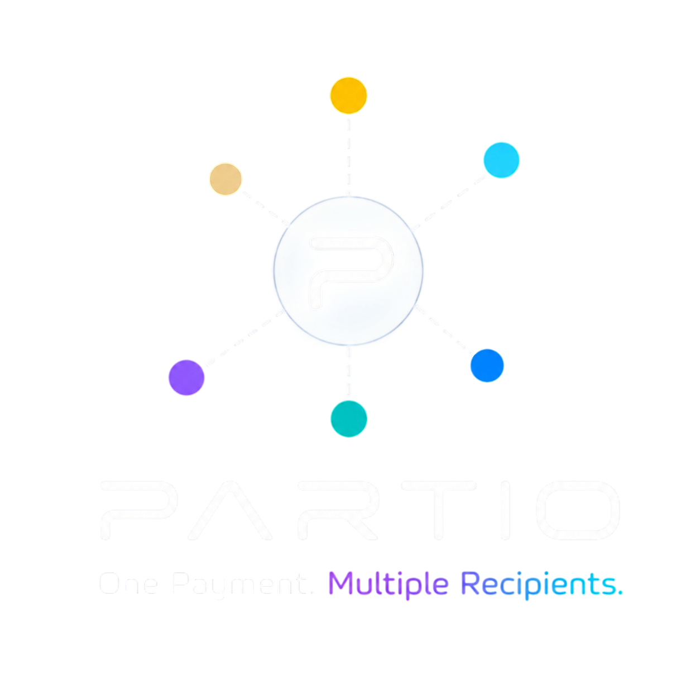

  

<h1 align="center">PARTIO</h1>

  <strong>One Payment. Multiple Recipients.</strong>

PARTIO is a payment application I'm building for the ARC Hackathon.

The idea is pretty simple: instead of making a separate payment for every person, you can prepare everything in one place and send one payment to multiple recipients.

PARTIO runs on ARC Testnet and uses Circle App Kit and Unified Balance. It can use both the connected wallet and Unified Balance when preparing a payment.

The payment is then sent through a Solidity smart contract, which splits the payment between the recipients.

I'm building this as a working demo and adding things step by step as I test them.

---

## Live Demo

🌐 https://partiopay.xyz

---

## How It Works

The basic flow is:

1. Connect your wallet
2. Add recipients
3. Enter an amount for each recipient
4. PARTIO calculates the total
5. It checks the wallet and Unified Balance
6. Review the payment
7. Confirm the transaction
8. The PARTIO contract sends the payment to the recipients

The main goal is to keep the whole process simple and avoid making the user deal with separate transactions for every recipient.

---

## Features

- USDC payments on ARC Testnet
- Multiple recipients in one payment
- Payment partitioning through a Solidity smart contract
- Circle App Kit
- Circle Unified Balance
- Circle Gateway
- Wallet connection
- ARC Testnet detection
- Network switching
- Wallet balance
- Unified Balance
- Contact management
- Transaction confirmation
- ArcScan transaction link
- Responsive UI
- Wallet + Unified Balance payments
- Base Sepolia and Arbitrum Sepolia support for Unified Balance
- Improved Unified Balance payment flow
- Faster payment preparation

---

## Circle Integration

PARTIO uses Circle's tools for the Unified Balance part of the payment flow.

### Circle App Kit

I'm using `@circle-fin/app-kit` to work with Unified Balance.

The basic setup looks like this:

~~~text
Wallet
  ↓
Viem Adapter
  ↓
Circle App Kit
  ↓
Unified Balance
~~~

### Unified Balance

Unified Balance lets PARTIO use USDC available through the user's Unified Balance.

PARTIO also checks the connected wallet balance.

If there isn't enough in Unified Balance to cover the payment, the remaining amount can be taken from the connected wallet.

For example:

~~~text
Payment: 15 USDC

Unified Balance → 4.981 USDC
Wallet          → 10.019 USDC
--------------------------------
Total           → 15.000 USDC
~~~

This means the user doesn't have to manually move the funds around before making the payment.

### Gateway

Circle Gateway is part of the infrastructure behind the Unified Balance flow.

I'm using Circle App Kit and Unified Balance APIs instead of building the lower-level Gateway flow myself.

---

## Supported Networks

PARTIO currently runs on ARC Testnet.

Base Sepolia and Arbitrum Sepolia is also supported in the Unified Balance deposit and balance flow.

I'm planning to add more networks as I continue working on the project.

---

## Smart Contract

The payment distribution is handled by the PARTIO Solidity smart contract on ARC Testnet.

The frontend collects the recipient addresses and amounts and sends them to the contract.

The contract then splits the payment between the recipients.

For example:

~~~text
Total: 5 USDC

Recipient 1 → 1 USDC
Recipient 2 → 1 USDC
Recipient 3 → 1 USDC
Recipient 4 → 1 USDC
Recipient 5 → 1 USDC
~~~

That's also where the name PARTIO comes from — partitioning one payment into multiple destinations.

---

## Payment Flow

PARTIO can use both Unified Balance and wallet funds in the same payment.

Before sending the payment, PARTIO checks how much can actually be used from Unified Balance.

If the full amount can be used, it goes directly with Unified Balance.

If not, PARTIO finds a usable amount and takes the rest from the connected wallet.

For example, if you want to send 15 USDC and 4.981 USDC can be used from Unified Balance:

~~~text
Unified Balance → 4.981 USDC
Wallet          → 10.019 USDC
Total           → 15.000 USDC
~~~

The idea is to make this happen in the background without making the user manually deal with the two balances.

---

## Recent Updates

I've recently spent some time improving the payment flow, especially the part involving Unified Balance.

The first version was working, but some payments were taking longer than I wanted.

I changed the way PARTIO checks how much can be spent from Unified Balance.

If the requested amount can already be spent, PARTIO doesn't keep doing unnecessary checks.

If it can't, it first tries to find a usable amount faster instead of immediately running a long search.

This made a pretty noticeable difference during my testnet tests.

Payments using only Unified Balance became much faster, and payments using both Unified Balance and wallet funds also improved.

The overall payment flow now feels much better compared to the earlier version.

---

## Built With

- ARC Network
- Solidity
- Next.js
- React
- TypeScript
- Wagmi
- Viem
- Tailwind CSS
- Circle App Kit
- Circle Unified Balance Kit
- Circle Viem Adapter
- Hardhat

---

## Project Structure

The project is split into a few main areas:

~~~text
app/
  Next.js application

components/
  Wallet, recipients and payment UI

hooks/
  Payment and application logic

src/unified/
  Circle Unified Balance integration
  Gateway and wallet adapters

contracts/
  PARTIO Solidity smart contracts

lib/
  Contract configuration and blockchain helpers
~~~

---

## Roadmap

There are a few things I want to add next.

### Currently Working On

- Transaction history
- Finding previous payments by wallet address
- New network integrations
- Feedback button
- Feedback system
- More payment flow improvements

### Planned

- Arc Name support
- Better mobile experience
- Improved contact management
- Better accessibility
- More UI improvements
- More payment options
- More detailed transaction history

I'd also like to explore a more unified payment experience for users who have funds on different networks.

Instead of making users bridge everything first, I'd like to see how much of this can be handled in the background with Circle's infrastructure.

There are still quite a few things I want to try with PARTIO, so this project will continue to evolve as I test and learn.

---

## Feedback

I'm still building and learning with PARTIO.

If you try the app and something doesn't work as expected, or you simply have an idea that could make it better, I'd really like to hear it.

Bugs, ideas and suggestions are all welcome.

I'm planning to add a feedback button directly into the app as well, so it will be easier to send feedback while using PARTIO.
